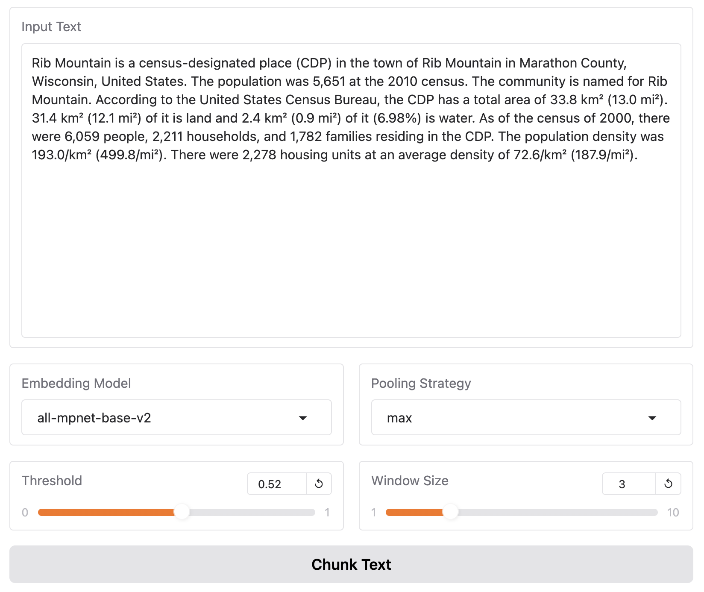
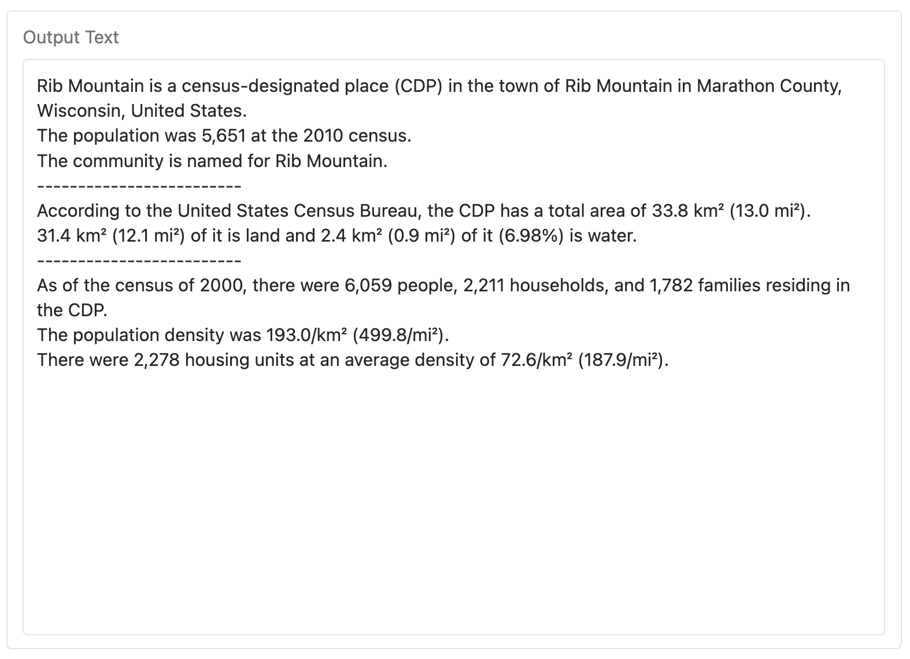
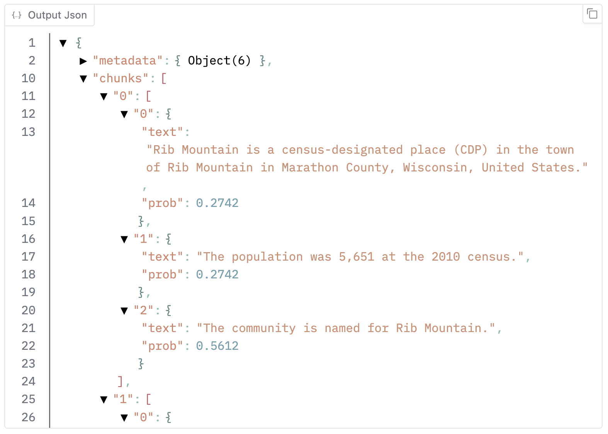
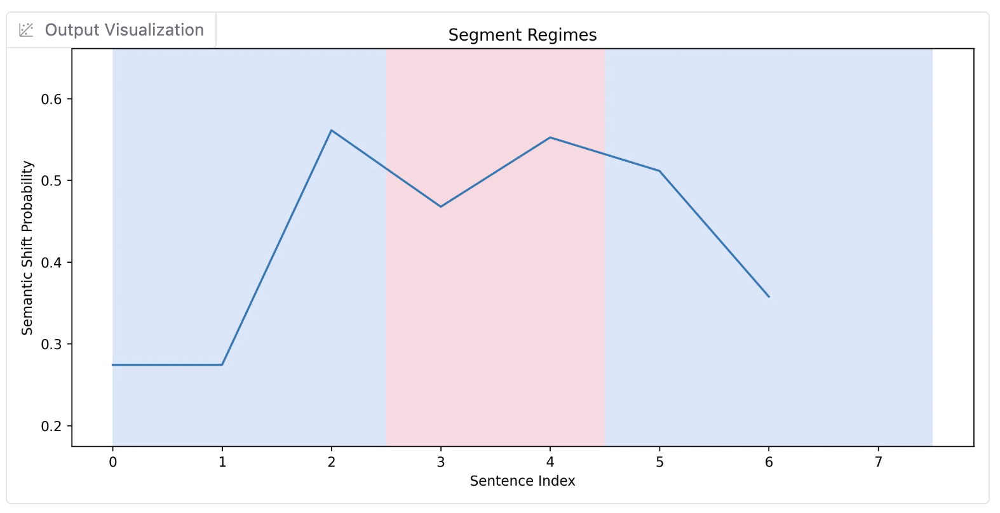

# Extended TextTiling using LLM Embeddings for Text Segmentation

This repository implements an **Extended TextTiling** algorithm for semantic topic segmentation within text documents. The method utilizes **cosine similarity** over **LLM (Large Language Model) embeddings** of sentence windows to predict semantic or topic shifts. The approach leverages SentenceTransformer and OpenAI models to perform sentence-level sequence labelling on text segmentation benchmarks, including Wiki-727K and WikiSection.

You may find a deployed demo for this repository on [Hugging Face Spaces](https://huggingface.co/spaces/saeedabc/llm-text-tiling-demo):

### Input Text and Parameters


### Output Text


### Output JSON


### Output Visualization



## Features

- **LLM Embeddings**: Uses OpenAI models or SentenceTransformer models for sentence embedding.
- **Cosine Similarity**: Computes an aggregated semantic similarity between sentence windows to the left and right of candidates to detect topic shifts.
- **Sentence Pooling**: Offers multiple pooling strategies (mean, max, min) for cosine similarity computation.
- **Hyperparameter Tuning**: Automatically tunes the window size, pooling method, and boundary threshold using a validation dataset.
- **Support for Multiple Datasets**: Tested on Wiki-727K and WikiSection (en_city and en_disease) datasets.

## Supported Embedding Models

- **[SentenceTransformer Models](https://sbert.net/)**: 
  - `all-mpnet-base-v2`
  - `all-MiniLM-L6-v2`

- **[OpenAI Models](https://platform.openai.com/docs/guides/embeddings)**: 
  - `text-embedding-ada-002`
  - `text-embedding-3-small`
  - `text-embedding-3-large`

## Supported Datasets

- **`wiki727k`**: Wiki-727K is a large dataset for text segmentation, automatically extracted and labeled from Wikipedia. (Already tailored for sentence-level sequence labelling: [Huggingface](https://huggingface.co/datasets/saeedabc/wiki727k)).

- **`en_city`**, **`en_disease`**: The WikiSection dataset is a collection of segmented Wikipedia articles related to cities and diseases. (Already tailored for sentence-level sequence labelling: [Huggingface](https://huggingface.co/datasets/saeedabc/wikisection)).

### Custom Dataset Integration

Any custom dataset can be easily integrated as long as it follows the schema below:

- `id`: string - A unique identifier for each document.
- `ids`: list[string] - The sentence ids within the document
- `sentences`: list[string] - The sentences within the document.
- `titles_mask`: optional[list[uint8]] - A binary mask to indicate which sentences are titles.
- `labels`: optional[list[int]] - Binary labels for each sentence, where 0 represents "semantic-continuity" and 1 represents "semantic-shift."

## Installation

1. Clone this repository:
   ```bash
   git clone https://github.com/saeedabc/llm-text-tiling.git
   cd llm-text-tiling
   ```

2. Install the required dependencies:
   ```bash
   pip install -r requirements.txt
   ```

3. Set your OpenAI API key as an environment variable (if using OpenAI models and don't want to be prompted in runtime):
   ```bash
   export OPENAI_API_KEY="your-openai-api-key"
   ```

## Usage

Run the script with the following arguments to segment text from one of the supported datasets:

```bash
python llm_tet.py --model_name [MODEL_NAME] \
    --data_name [DATASET_NAME] --max_samples [N] --seed [SEED] \
    --cache_dir [CACHE_DIR]
```

- `--model_name`: The name of the model to use for embedding (`text-embedding-ada-002`, `all-mpnet-base-v2`, etc.).
- `--data_name`: The dataset to use (`wiki727k`, `en_city`, `en_disease`).
- `--keep_titles`: Option to keep titles within the dataset.
- `--max_samples`: Limit the number of samples to process for faster testing.
- `--seed`: Set a random seed for reproducibility.
- `--cache_dir`: Directory to cache embeddings for reuse.

### Example Command

1. Inference on `en_city` with `all-mpnet-base-v2`:
```bash
python llm_tet.py --model_name all-mpnet-base-v2 --data_name en_city --max_samples 100 --seed 42 --cache_dir ./cache
```
2. Inference on `en_city` with `text-embedding-ada-002`:
```bash
python llm_tet.py --model_name text-embedding-ada-002 --data_name en_city --max_samples 100 --seed 42 --cache_dir ./cache
```

## Algorithm Workflow

1. **Embedding Sentences**: Sentences in each document are embedded using the selected model.
2. **Cosine Similarity Calculation**: Cosine similarities between adjacent sentence windows are computed using different pooling strategies.
3. **Boundary Prediction**: A threshold is applied to these cosine similarities to predict topic shift boundaries.
4. **Evaluation**: The predicted boundaries are evaluated using precision, recall, and F1 score against ground truth labels.

## Hyperparameter Tuning

The script tunes three hyperparameters:
- **Window size (`k`)**: The number of sentences to include in each window.
- **Pooling strategy (`mean`, `max`, `min`)**: How to combine the cosine similarities of sentence embeddings within a window.
- **Cosine similarity threshold**: The cutoff to determine whether a topic shift has occurred.

Tuning is performed on the validation set, and the best hyperparameters are applied to the test set.

## Results

After tuning, the script provides precision, recall, and F1 score for test dataset as well as the best hyper-parameter config based on validation set.

1. Inference on `en_city` with `all-mpnet-base-v2`:
```bash
...
Validation score: F1=36.94, Prec=31.87, Recall=43.94 | Tuned hp: {'k': 5, 'pool': 'mean', 'threshold': 0.19}
...
Test score: F1=34.70, Prec=29.93, Recall=41.28
```

2. Inference on `en_city` with `text-embedding-ada-002`:
```bash
...
Validation score: F1=39.97, Prec=35.32, Recall=46.02 | Tuned hp: {'k': 3, 'pool': 'mean', 'threshold': 0.775}
...
Test score: F1=40.80, Prec=35.74, Recall=47.52
```

## License

This project is licensed under the MIT License. See the [LICENSE](LICENSE) file for details.

---

Contributions and pull requests are welcome.
